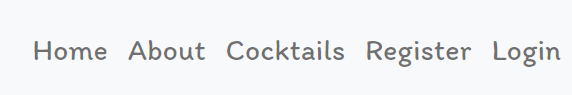
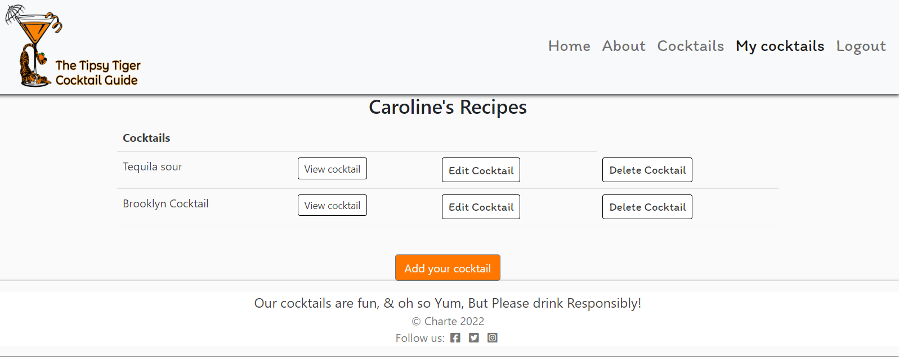
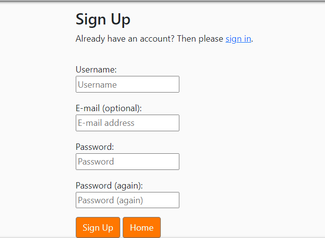
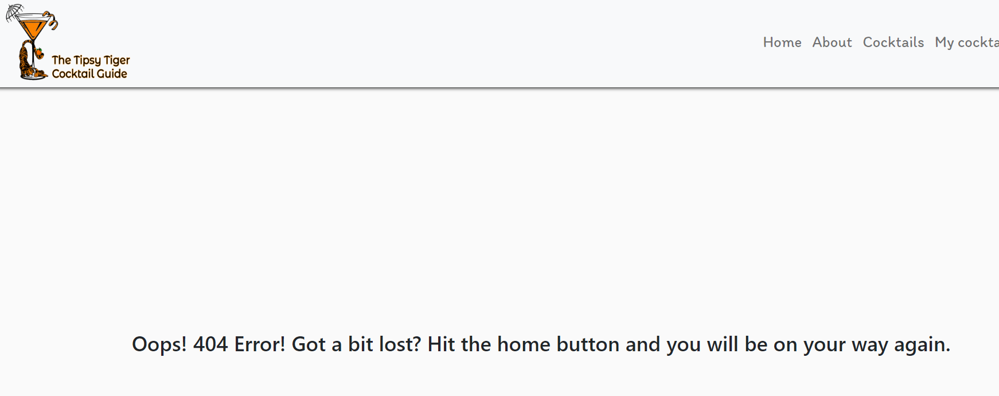
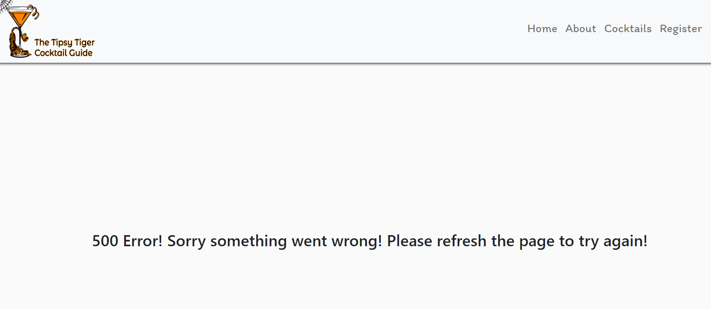
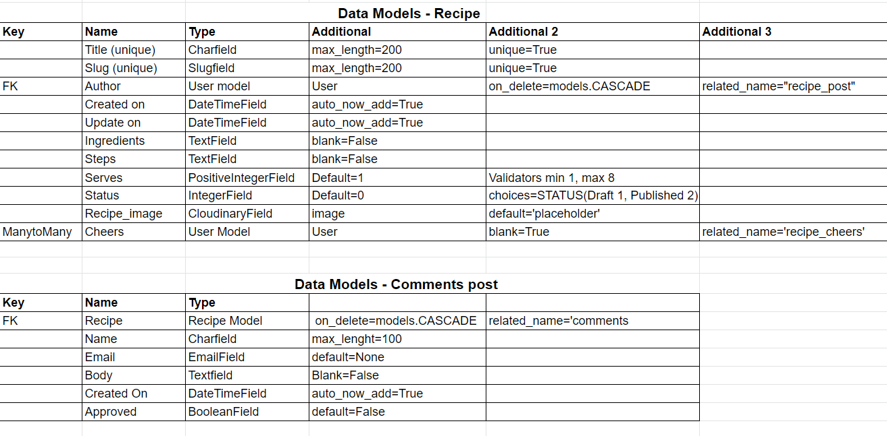

# The Tipsy Tiger Cocktail Guide


### *Live link to [The Tipsy Tiger Cocktail Guide](https://the-tipsy-tiger.herokuapp.com/)*

# Table of contents:
- ##  [Context](#context)

- ##  [UX](#UX)
     - [Agile](#Agile)
     - [Project Goal](#Project-goal)
     - [Target Audience](#Target-audience)
     - [Epics and user stories](#Epics-user-stories)
     - [Scope](#Scope)

- ##  [Features](#Features)
     - [Structure](#Structure)
     - [Existing Features](#Existing-features)
     - [Age verfication](#Age-verfication)
     - [All pages](#All-pages)
     - [Home page](#Home-page)
     - [About page](#About-page)
     - [Cocktail Recipe Page](#Cocktails-recipe-page)
     - [My Cocktails Page](#My-cocktails-page)
     - [Recipe detail page](#Recipe-detail-page)
     - [Recipe form](#Recipe-Form)
     - [Sign-In form](#Sign-In-Form)
     - [Register form](#Register-form)
     - [404 page](#404-page)
     - [500 page](#500-page)
     - [Future features](#Future-features)

- ##  [Design](#Design)
     - [Flowchart](#Flowchart)
     - [Wireframes](#Wireframes)
     - [Data Models](#Data-models)
     - [Colors](#Colors)
     - [Fonts](#Fonts)

- ##  [Technologies Used](#Technologies-Used)  
     - [Languages](#Languages)
     - [Frameworks](#Frameworks)
     - [Database](#Database)
     - [ Other Technologies](#Other-Technologies)

- ##  [Testing](#Testing)
     - [Tests](#Tests)

- ##  [Deployment](#Deployment) 
    - [Heroku](#Heroku)
    - [Forking](#Forking)
    - [Cloning](#Cloning)        

- ##  [Images](#Images) 

- ##  [Cocktail Recipes](#Cockatail-Recipes) 

- ##  [Credits](#Credits) 


## Context 
The Tipsy Tiger Cocktail Guide is a recipe style website, that displays cocktail recipes created and posted by users on the site. 

The website is simple:
- Non registered users can view the site and can register for an account in an easy process.
- Logged in users have a range of options available.
- User can view full page cocktail recipe details.
- User can create their own cocktail recipe.
- User can edit their own cocktail recipes
- User can delete their own cocktail recipes
- User can interact with other posts on the site in the form of comments or liking the cocktail

## UX

### Agile
The Agile methodology was used to plan and create the project. Google sheets and Github were the tools used to demonstrate this.
1. Projects were used to divide the project into three iterations with a simple kanban board.
2. Milestones were used to create User Stories with a custom template.
3. Issues were used to create each individual User Story. Each story defines the title, statement, and acceptance criteria.

* Each user story was grouped into an Epic and placed within one of the three iterations.The User Stories were classified as 'must-have', 'could-have', & 'should-have' in order to priortise the work. As progress was made on each user story it was moved from 'to do' across to 'In Progress' column. When each user story wass complete it was moved across to 'done' column.

* However it was difficult in Github since the projects application changed, to adequately link iterations - Epic - User Stories. To help keep further track and make it easier to follow the Agile methodology I used Google Sheets to create a [project kanban board](https://docs.google.com/spreadsheets/d/1T_LNmWw8ennfcJeJCG63nfQmfHPUSE6cgO4ReGNBRmg/edit?usp=sharing) to track progress in the event Github Projects didn't fulfill the Agile requirements the project had. Although I linked User Stories (Issues) to Epics (Milestones) and placed these in Iterations (Milestones), Epics did not automatically show the % progress to completion once user stories were moved in the kanban board on Github projects.

### Project Goal
* The goal of this project was to create a cocktail recipe site with tried and tested cocktails for get together's. As the world was separate for a while due to covid, socializing habits changed and more people stayed at home and entertained when it was safe to do so. While there is still a need for pubs and clubs, more and more home parties are being organized. From bbq's to baby showers and milestone birthday parties. With this in mind, The Tipsy Tiger Cocktails Guide was created. To help people add something special to the celebrations.

### Target audience

The target User is someone:
* Who wants to add a homemade cocktail to impress their guests.
* Who wants to be able to modifify and control alcohol limit in each drink.
* Who wants to add the personal touch to celebrations.
* Who wants to engage with others who have the same interest in cocktails.
* Who wants to share their own creations and recipes.

### Epics and User Stories 
In order to efficently build the site, 10 Epics and 19 user stories were created to cover all the bases of the final site. 
1. Epic: Set up an admin page to manage posts, reviews, comments and user with comments.

* User Stories: 
    * As an admin I can post content so that there is a decent library of recipes.[#1](https://github.com/Charte-dot/The-Tipsy-Tiger-cg/issues/1)

    * As an admin I can approve content so that the it's only relevant content posted[#2](https://github.com/Charte-dot/The-Tipsy-Tiger-cg/issues/2)

    * As an admin I can approve reviews so that I can filter inappropriate content[#3](https://github.com/Charte-dot/The-Tipsy-Tiger-cg/issues/3)


2. Epic: Enable users to set up an account on the website to access the full features.

* User Stories: 
    * As a user I can register an account so that I can access the full range of features on the site[#4](https://github.com/Charte-dot/The-Tipsy-Tiger-cg/issues/4)

    * As a user I can login and logout of the site so that I can access my content and interact with other users content.[#5](https://github.com/Charte-dot/The-Tipsy-Tiger-cg/issues/5)

    * As an admin I can set an age verification so that underage users can't access alcohol based topics.[#6](https://github.com/Charte-dot/The-Tipsy-Tiger-cg/issues/6)


3. Epic: Create an attractive landing page to entice new users and get them to register an account.

* User Stories:
    * As a user I can see a show case of recipes so I know what style of content is published on the site[#7](https://github.com/Charte-dot/The-Tipsy-Tiger-cg/issues/7)

    * As a user I can access the recipes from a new tab so I don't loose my position on the site.[#8](https://github.com/Charte-dot/The-Tipsy-Tiger-cg/issues/8) 

    
4. Epic: Enable registered users to CRUD their own reciepes.

* User Stories:

    * As a registered user I can create, read, update and deleted my own recipes so that I can manage my own content.[#9](https://github.com/Charte-dot/The-Tipsy-Tiger-cg/issues/9)
    

5. Epic: Show case the most populate recipes on the main landing page

* User Stories:

    * As a user I can view a list of recipes so that I can see what content is available before I decide to register.[#10](https://github.com/Charte-dot/The-Tipsy-Tiger-cg/issues/10)

    * As a user I can view a paginated list of recipes so I can move through the content easily.[#11](https://github.com/Charte-dot/The-Tipsy-Tiger-cg/issues/11)

    * As an unregistered user I still access content so that I can decide to register at a later time[#12](https://github.com/Charte-dot/The-Tipsy-Tiger-cg/issues/12)


6. Epic: Enable users to Filter content to find reciepes with certain ingrediants.

* User Stories:

    * As a User I can Search recipes by ingredients so that i can find content easily.[#13](https://github.com/Charte-dot/The-Tipsy-Tiger-cg/issues/13)

    * As a User I can filter recipes by skill and base so I can easily find cocktails[#14](https://github.com/Charte-dot/The-Tipsy-Tiger-cg/issues/14)


7. Epic: Enable registered users to be able to interact with posts from other users.

* User Stories:

    * As a registered user I can Like or Unlike other users posts so I can interact with the site.[#15](https://github.com/Charte-dot/The-Tipsy-Tiger-cg/issues/15)

    * As a registered user I can comment on other recipes to help with overall UX[#16](https://github.com/Charte-dot/The-Tipsy-Tiger-cg/issues/16)


8. Epic: Enable users to CRUD own reviews and comments.

* User Stories:

    * As a registered user I can create/read/update/delete my own review posts so that I can manage my own content[#17](https://github.com/Charte-dot/The-Tipsy-Tiger-cg/issues/17)


9. Epic: Enable user to sign-in/ register with Google/facebook account.


* User Stories:

    * As a user I can register an account with social networks so that I can verify my account easily[#18](https://github.com/Charte-dot/The-Tipsy-Tiger-cg/issues/18)


10. Epic: Enable user to upload pictures with recipes that are added.

* User Stories:
 
    * As a user I can upload a picture to enhance the content that I post to the site.[#19](https://github.com/Charte-dot/The-Tipsy-Tiger-cg/issues/19)


### Scope

The scope of the project was quiet extensive at the beginning. The over all goal was to give users full CRUD on all of their content. Due to time constraints this meant user's only had CRUD functionality on cocktail recipes and as this was deemed a must have and took priorty. More functionality for logged in users will be added in the future. Further front-end admin functions will be added as this project is limited to back-end django admin panel. 

## Features
### Structure 
The website consists of six pages:
* Home
* About
* Cocktails
* My Cockatails
* Register
* Sign-in/Sign-Out
Home, about and cocktail pages and be viewed by all users. My cocktails is limited to registered and logged in users.

# Existing Features
### Age verification
* As the recipe site is based on alcohol themes, an age verification asks the user if they are over 18 


*Main page age verfication*

* If the user is not over 18 and clicks the 'not over 18 link a decline page is activated.


*Age verfication decline*

#### All pages
    
*Navigation bar*:
  * Brand logo linking back to the home page.


   *Logo*

* Links to the Home, About, Cocktails, My Cocktails, Register and Sign-in/Sign-out Pages: Home, about and cocktail pages and be viewed by all users. My cocktails is limited to registered and logged in users.
If the user is not signed in the Sign in and Register links are visible in the navbar. If the user is signed in the Sign In and Register links are replaced by a Sign Out link and the My Cocktails page link is visible:


   *Navigation for unregistered users*

*Navigation for logged in users*

* The Navigation bar sticks to the top of the page and remains in view while the user is scroling for easy access around the site.


   *Sticky Nav*

   
* The navigation bar collapses for smaller screen sizes
   

   *Smaller nav bar*

   
   - Footer: Clear visiable links to social media sites, Facebook, Twitter and Instagram


   *Footer*

### Home page
* Hero Image with overlay test of the site name.


*Hero image*

* Text directing user to the cocktail recipe page.


*Cocktail recipe page link*

* Snapshot of three most recent cocktails posted with title, date added and Author. This page updates automatically ever time a new cocktail is added.


* Home Page Cocktail Snapshot*

* Call to action button 'Register' at the bottom of the page to direct users that want to register to the registration form.


*Registeration link*

### About Page
* Image with text information about the website, with links to recipe page, register page and login page.


*About page with link*

### Cocktail recipe page
* Images with description of skill level and alcohol base type visible to all users. Cocktail title is a link to full recipe details if the user is logged in, if not this redirects to the Sign-In Page. Glasses representing a like and comment icons have total number interactions beside them.


*Cocktail page*

* A filter for the skill level and alcohol base above the cocktail page enables users to filter the cocktails to a skill level of choice and a choice of alcohol based cocktail. Clickable icon to submit the filter choices.


*Skill Filter*


*Base Filter*

* The cocktail title links to the full recipe details which can only be accessed by registered or logged in users. User who are not logged in are redirected to the sign-in page.


*Cocktail Title*

* A call to action 'Add a cocktail' button will directed logged in users to my recipes page and non logged in users to the sign in page. This allows intuitive navigation on the site.


### My Cocktail page
* This page can only be accessed by logged in users. The navigation link only appears when the user is logged in.

* The list of cocktails added by the user are organised in a table, with the most recently created at the top of the list. This table displays the title, view cocktail, edit cocktails and delete cocktail. 


*cocktails table*

* View Cocktail opens the full recipe page for that cocktail.
* Edit cocktail opens the edit form to allow the user to make amendments to the recipe.


*Edit form*

* A pop up message alerts the user that the cocktail has successfully edited.


*Edit message*

* Delete cocktail enables a user to delete the cocktail. This removes the cocktails from the users own cocktail list and from view on the home page and cocktail page. 


*Delete cocktail confirmation*


*Successful delete message*


### Recipe Detail Page
 Accessed only by logged in users by clicking on the View tab in the 'my cocktails' table or by the title link on the 'cocktails' page.


*Recipe details page*

* The clinking glass Icon can be clicked to give a 'Cheers' and remove the 'Cheers from a recipe. The cheers feature is a play on a like feature.

* The number of 'Cheers' given to a cocktail recipe is displayed beside the icon in recipe details page and beside the icon in the cocktails page.

* Message to confirm each action is displayed.


*Cheers confirmation message*


*Removal of cheers message*

* The about section of the recipe includes, number of comments, serve amount per recipe, skill level, alcohol base and an 'Updated on field'.


*About page on recipe details*

* If the user has created a recipe and the recipe is currently posted the author of the recipe will have two extra features on their on created recipe. An edit option and a delete option appear on the bottom of the recipe. This is only viewable to the Author of that recipe.
This is to promote intuitive navigation. 


*Extra feature for the author of the recipe*


*View for non author of the recipe*

* Comments:
At the bottom of the recipe ingrediants and steps is the Comment section to display comments in descending order by date.


*Comments*

* Below the published comments is a from to submit a comment.
* After submission of comment an 'pending approval' message is shown until admin approve the comment.


*Comment form*


*Awaiting admin approval*


*Thanks for your thoughts message*

### Recipe Form
* A form complete with field to order to enable the user to add/ create cocktail recipes as part of the CRUD fuctionality.
* Users can copy and paste recipes directly into the ingrediants and steps fields. Images can be uploaded and a placeholder image is supplied incase no image is uploaded by the user.
* A submit button allow the user to publish the cocktail they have just created.
* Home button redirect user back to the home page without publishing a cocktail


### Sign-In Form

* User Signs in by entering Username and password created when registering.

* An Action button for sign-in which redirects back to the home page once user is signed in. 


*Sign-in form*


*Sign-In pop up message*


### Register Form

* Users can register for an account by entering a username, an optional email and a password.

* A choice of  call to action buttons. Sign-up completes the registration and redirects user back to the home page. Home button redirects user to home page but no account has been registered. 


*Registeration form*


*Registeration success message*


### 404 page
* A 404 page was created to handle navigational errors within the site. It alerts the user of an error and advised how to rectify the issue.


*404 error*

### 500 page
* A 500 server error page was created to handle internal server errors. This alerts the user and advised on possible fix to rectify the issue.




### Future Features
* Addition of a search bar for easier naviagtion of cocktail recipes currently posted.
* Refining the filter options to filter by the recipe the user liked and commented on.
* The option for users to CRUD comments in the same style as the CRUD functionality for the cocktail recipes.
* User log in with social media.
* Currently images can be uploaded to the recipe form from the user's own computer or by a url. This could be further defined by size and image type to ensure consistancy throughout the site.

### Design 

### Flowchart
 * I designed a basic flowchart on [Lucid Chart](https://lucid.app/lucidchart/8619b2ff-1840-4d3a-b234-ac143540d744/edit?page=0_0&invitationId=inv_9469ea28-80f3-48d1-943c-643df72710da#) first.This was to give me a template to follow and to make sure my original design that I had planned was the outcome and final layout of the application. This was an essential piece to the project along side the epics and user stories as it helped me keep track of how the application would be displayed to the user and the steps the user would take within the application.

- How would the flow of the website be laid out?
- How would I deal unregistered users?
- What benefits where there for registered and logged in users? 
 
 


 ### WireFrames
I designed a basic wireframe to compliment the Epics, User stories and flow chart.This was to give me a template to follow and to make sure my original design that I had planned was the outcome and final layout of the application. Some feature have been change due to time constraints.

* Age verification


* Home page


* About page


* Cocktail recipe page


* My cocktail Page


* Cocktail recipe form


* Registration form


* Sign in form


### Data Models
There are two models used for the database: A recipe model and a comment model.


*Data Model*

The googlesheet of these models can be found [Here](https://docs.google.com/spreadsheets/d/1C02nlF7PXHJwVVeX6fccqtWrPZb4RqBYxgY8-sqb3lQ/edit?usp=sharing)


### Colors
The following colors palette was used through the site.


* The main background color is RGB(248, 248, 248). I wanted a clean muted background color as the main images on the site would be colorful and eye catching. It is a soft muted white to take the harshness of pure white and soften the users visual experience.

* The main text body is RGB(33, 37, 46), a shade of navy for the large important text on the site. I choose navy as it wasn't as harsh as black and still noticable to the user.

* The nav-bar hover, cocktail titles, cocktail info are all RGB(115, 112, 112). A soft grey to contrast against the main background color. 

* The predominant color of RGB(208, 98, 1) was choosen to reference back to the site logo but on a muted softer scale. All action buttons, links and text underline are this shade of orange. This choice was made to tie all the pages together and on pages like registration form where it is quite neutral, it gives a small pop of color.

### Fonts
* The fonts chosen for the site were: [Itim](https://fonts.google.com/?query=itim) the nav-bar and recipe titles. [Architects Daughter](https://fonts.google.com/?query=architects+daughter) for all other text.


# Technologies Used
## Languages
* [html](https://www.w3schools.com/html/) was used to build the front end of the site.
* [CSS](https://www.w3schools.com/CSS/) was used to style all elements and add responsiveness to the site.
* [JavaScript](https://www.w3schools.com/js/default.asp) was used alnog side Bootstrap to provide inactivity on the site.
* [BootStrap 5.1.3](https://www.w3schools.com/bootstrap5/index.php) was used for extra stylings and mostly for responsiveness for all screen sizes reducing the use of media queries.
* [Python](https://www.w3schools.com/python/default.asp) was used for backend functionality.
* [PyPI](https://www.w3schools.com/python/python_pip.asp) used to install python packages.

## Frameworks
* [Django 3.2.8](https://www.w3schools.com/django/index.php)
    
    * [allauth](https://django-allauth.readthedocs.io/en/latest/installation.html) for authentication, registration and account management.

    * [Crispy-forms](https://django-crispy-forms.readthedocs.io/en/latest/install.html) for a uniformed form across the site for registeration, sign-up and create a recipe.

    * [Django filter](https://django-filter.readthedocs.io/en/stable/) was used to create the filter system on the recipes. 

    * [Summernote](https://summernote.org/getting-started/) used as an editor for the site.

    * [Gunicorn](https://gunicorn.org/) was used as the server for the deployment application Heroku.

    * [Psycopg2](https://pypi.org/project/psycopg2/) as an adptor for Python and PostgreSQL databases.

    * [dj-databases](https://pypi.org/project/dj-database-url/) to parse the database URL from the environment variables in Heroku.


    ## Databases
    * Heroku Postgres for the production database
    * SQlite was used for the local environment for automated testing.

    ## Other Technologies
    * [Cloudinary](https://cloudinary.com/) to host the static files and media.
    * [Gitpod](https://www.gitpod.io/?utm_source=googleads&utm_medium=search&utm_campaign=dynamic_search_ads&utm_id=16501579379&utm_content=dsa&gclid=Cj0KCQjwmouZBhDSARIsALYcouquUuX8zY7N7IzWGRj38urfL52WB2MMf7qGe3IVNQJZqd4v1brI9kAaArMnEALw_wcB) was used for IDE.
   * [Git](https://git-scm.com/) used for version control via the terminal in Gitpod.
   * [GitHub](https://github.com/) used to store the code in the repository. 
   * [Heroku](https://www.heroku.com/home) used for the cloud based platform for project deployment.
   * [Fontawesome](https://fontawesome.com/) for all icons used on site.
   * [Google fonts](https://fonts.google.com/) for all fonts used on site.
   * [Balsamiq](https://balsamiq.com/wireframesgclid=Cj0KCQjwmouZBhDSARIsALYcournwJNUGD9kYhuv) used to create wireframes.
   * [LucidChart](https://www.lucidchart.com/) used for the flow chart diagram.
   * [Google Chrome Dev Tools](https://developer.chrome.com/docs/devtools/) for inspection during development to check responsivness and help debug code.
   * [Techsini](https://techsini.com/multi-mockup/index.php) used to generate site mockup.
   * [Google Chrome](https://www.google.com/) for previewing project during development.
   * [Google sheets](https://www.google.com/sheets/about/) for Epics and user stories aswell as data model tables.
   * [Adobe Express](https://www.adobe.com/express/) for the creation of site logo and background image on age verfication page.
   * [Tinypng](https://tinypng.com/) for resizing and compressing image sizes
   * [Coverage](https://coverage.readthedocs.io/en/6.4.4/) to general a report for automated testing.
   * [W3C Markup Validation service](https://validator.w3.org/) For validating HTML code
   * [W3C CSS validation service](https://jigsaw.w3.org/css-validator/)
   * [PEP8](http://pep8online.com/) for validation of python code.


## Testing
### Tests
* The full testing documentation can be accessed [here](TESTING.md)

## Deployment
### Heroku
####  Creating the inital Django app
* First follow these steps to create your app:
add to local deployment section: here
* Install Django and gunicorn: `pip3 install django gunicorn`
* Install supporting database libraries dj_database_url and psycopg2 library: `pip3 install dj_database_url psycopg2`
* Install Cloudinary libraries to manage photos: in the terminal window type `pip3 install dj-3-cloudinary-storage`
* Create file for requirements: in the terminal window type `pip freeze --local > requirements.txt`
* Create project: in the terminal window type `django-admin startproject project_name .`
* Create app: in the terminal window type `python3 manage.py startapp app_name`
* Add app to list of `installed apps` in settings.py file: `'app_name'`
* Migrate changes: in the terminal window type `python3 manage.py migrate`
* Run the server to test if the app is installed: in the terminal window type `python3 manage.py runserver`
* If the app has been installed correctly the window will display `The install worked successfully! Congratulations!`

####  Create your Heroku app
* Navigate to the Heroku website
* In the Heroku browser window, create an account by entering your email address and a password
* Activate the account through the authentication email sent to your email account
* Click the new button and select create a new app from the dropdown menu
* Enter a name for the application which must be unique, in this case the app name is 'the-tipsy-tiger'
* Select a region, in this case Europe
* Click create app

#### 3. Create the Database
* In the Heroku dashboard click on the Resources tab
* Scroll down to Add-Ons, search for and select 'Heroku Postgres'
* In the Settings tab, scroll down to 'Reveal Config Vars' and copy the text in the box beside DATABASE_URL.

#### 4. Set up Environment Variables
* In Gitpod create a new env.py file in the top level directory
* Add env.py to the .gitignore file
* In env.py import the os library
* In env.py add `os.environ["DATABASE_URL"]` = "Paste in the text link copied above from Heroku DATABASE_URL" from step 3
Insert yours here
* In env.py add `os.environ["SECRET_KEY"] = "Make up your own random secret key"`
* In Heroku Settings tab Config Vars enter the same secret key created in env.py by entering 'SECRET_KEY' in the box for 'KEY' and your randomly created secret key in the 'value' box.

#### 5. Connect the environment variables to Django

* In your Django 'settings.py' file type:

 ```
 from pathlib import Path
 import os
 import dj_database_url

 if os.path.isfile("env.py"):
  import env
 ```
* Remove the default insecure secret key in settings.py and replace with the link to the secret key variable in Heroku by typing: `SECRET_KEY = os.environ.get(SECRET_KEY)`
* Comment out the `DATABASES` section in settings.py and replace with:
```
DATABASES = {
  'default': 
  dj_database_url.parse(os.environ.get("DATABASE_URL"))
  }`
```
#### 6. Make migrations
* In the terminal type:
```
python3 manage.py makemigrations`
python3 manage.py migrate`
```

#### 7. Set up Cloudinary for static and media files storage
* Create a Cloudinary account and from the 'Dashboard' in Cloudinary copy your url into the env.py file by typing: `os.environ["CLOUDINARY_URL"] = "cloudinary://<insert-your-url>"`
* In Heroku  add cloudinary url to 'config vars'
* In Heroku config vars add DISABLE_COLLECTSTATIC with value of '1' (note: this must be removed for final deployment)
* Add Cloudinary libraries to installed apps section of `settings.py` in this order: 
 ```
 'cloudinary_storage'
 'django.contrib.staticfiles''
 'cloudinary'
 ```
* Connect Cloudinary to the Django app in `settings.py`:
```
STATIC_URL = '/static'
STATICFILES_STORAGE = 'cloudinary_storage.storage.StaticHashedCloudinaryStorage'
STATICFILES_DIRS = [os.path.join(BASE_DIR, 'STATIC')]
STATIC_ROOT = os.path.join(BASE_DIR, 'staticfiles')
MEDIA_URL = '/media/'
DEFAULT_FILE_STORAGE =
'cloudinary_storage.storage.MediaCloudinaryStorage'
* Link file to the templates directory in Heroku 
* Place under the BASE_DIR: TEMPLATES_DIR = os.path.join(BASE_DIR,
'templates')
```
* Change the templates directory to TEMPLATES_DIR. Place within the TEMPLATES array: `'DIRS': [TEMPLATES_DIR]`
* Add Heroku Hostname to ALLOWED_HOSTS: ```ALLOWED_HOSTS =
["the-tipsy-tiger.herokuapp.com", "localhost"]```

#### 8. Create `media`, `static` and `templates` folders in top level directory
#### 9. Create Procfile in top level directory: 
* In Procfile add: `web: gunicorn thetipsytiger .wsgi`
#### 10. In terminal add, commit, and push: 
```
git add <filename>
git commit -m “Deployment Commit”
git push
```
#### 11. Heroku Deployment: 
* Click Deploy tab in Heroku
* In the 'Deployment method' section select 'Github' and click the 'connect to Github' button to confirm.
* In the 'search' box enter the Github repository name for the project: https://github.com/Charte-dot/The-Tipsy-Tiger-cg

* Click search and then click connect to link the heroku app with the Github repository. The box will confirm that heroku is connected to the repository.

#### 12. Final Deployment
In the IDE: 
* When development is complete change the debug setting to: `DEBUG = False` in `settings.py` 
* In this project the [summernote](https://summernote.org/) editor was used so for this to work in Heroku add: `X_FRAME_OPTIONS = 'SAMEORIGIN'` to settings.py.
* In Heroku settings config vars change the DISABLE_COLLECTSTATIC value to 0
* Because DEBUG must be switched to True for development and False for production it is recommended that only manual deployment is used in Heroku. 
* To manually deploy click the button 'Deploy Branch'. The default 'main' option in the dropdown menu should be selected in both cases. When the app is deployed a message 'Your app was successfully deployed' will be shown. Click 'view' to see the deployed app in the browser.

### Local Deployment: Forking and Cloning
#### Forking the Repository

* To fork the project navigate to The Tipsy Tiger cg repository at https://github.com/Charte-dot/The-Tipsy-Tiger-cg

* Above the list of files click the dropdown menu.
* Select the https option and copy link.
* Open terminal.
* Change the current working directory to the desires destination location.
* Click 'fork' at the top right of the page. A forked copy of the repository will appear in the Repositoties.

#### Cloning the Repository

* On Github navigate to the main page of The Tipsy Tiger cg at https://github.com/Charte-dot/The-Tipsy-Tiger-cg.
* Above the list of files click the dropdown code menu.
* Select the https option and copy the link.
* Open the terminal.
* Change the current working directory to the desired destination location.
* Type the git clone command with copied URL:
`git clone https://github.com/Charte-dot/The-Tipsy-Tiger-cg.git`.
* Press enter to creat the local clone.
* For the project to run an env.py file must be created as in step 4 of 'creating your Heroku app' above. As this is not stored in Github it will not be cloned with the rest of the files.

### Images
* [Hero Image](https://images.unsplash.com/photo-1547059470-3b0c7cd958a4?ixlib=rb-1.2.1&ixid=MnwxMjA3fDB8MHxzZWFyY2h8NzN8fGNvY2t0YWlsc3xlbnwwfHwwfHw%3D&auto=format&fit=crop&w=600&q=60) from Unsplash by Walter Lee Oliverios

* [Bourbon cocktail](https://images.unsplash.com/photo-1470337458703-46ad1756a187?ixlib=rb-1.2.1&ixid=MnwxMjA3fDB8MHxzZWFyY2h8MTl8fGNvY2t0YWlsc3xlbnwwfHwwfHw%3D&auto=format&fit=crop&w=600&q=60) from Unsplash by Adam Jamie

* [Back up image](https://images.unsplash.com/photo-1586338211598-e2d64cf97e28?ixlib=rb-1.2.1&ixid=MnwxMjA3fDB8MHxzZWFyY2h8ODV8fGNvY2t0YWlsc3xlbnwwfHwwfHw%3D&auto=format&fit=crop&w=500&q=60) from Unsplash by Andrea Riezzo

* [About Image](https://images.unsplash.com/photo-1574449126805-6f11acf5a8c5?ixlib=rb-1.2.1&ixid=MnwxMjA3fDB8MHxwcm9maWxlLXBhZ2V8MjN8fHxlbnwwfHx8fA%3D%3D&auto=format&fit=crop&w=500&q=60) From Unsplash by Rinck Content Studio

* [Black Russian](https://www.bbcgoodfood.com/recipes/black-russian-cocktail) From bbcgoodfood

* [Non alco cream liqueur](https://www.bbcgoodfood.com/recipes/non-alcoholic-irish-cream-liqueur) From bbcgoodfood.

* [Singapore sling](https://www.bbcgoodfood.com/recipes/singapore-sling) From bbcgoodfood

* [Brown Derby](https://www.bbcgoodfood.com/recipes/brown-derby)from bbcgoodfood

* [Rhubard and Custard](https://www.bbcgoodfood.com/recipes/rhubarb-custard-cocktail) from bbcgoodfood.

* [Tequila sour](https://www.acouplecooks.com/tequila-sour/) from a couple cooks

* [Mojito](https://www.bbcgoodfood.com/recipes/mojito) From bbcgood foods.

* [Brooklyn Cocktail](https://images.unsplash.com/photo-1572590016064-3e6ae9c04947?ixlib=rb-1.2.1&ixid=MnwxMjA3fDB8MHxzZWFyY2h8NDF8fG9yYW5nZSUyMGNvY2t0YWlsfGVufDB8fDB8fA%3D%3D&auto=format&fit=crop&w=600&q=60) from Unsplash by Wesley Tingey

*All images from bbc good foods and a couple cooks, were screenshot, saved on local drive and uploaded to cloudinary to use within the site*

## Cockatail Recipes

* [Black Russian](https://www.bbcgoodfood.com/recipes/black-russian-cocktail) 

* [Non alco cream liqueur](https://www.bbcgoodfood.com/recipes/non-alcoholic-irish-cream-liqueur) 

* [Singapore sling](https://www.bbcgoodfood.com/recipes/singapore-sling) 

* [Brown Derby](https://www.bbcgoodfood.com/recipes/brown-derby)

* [Rhubard and Custard](https://www.bbcgoodfood.com/recipes/rhubarb-custard-cocktail) 

* [Tequila sour](https://www.acouplecooks.com/tequila-sour/) 

* [Mojito](https://www.bbcgoodfood.com/recipes/mojito) 

* [Brooklyn Cocktail](https://www.acouplecooks.com/brooklyn-cocktail/) 

* [Bourbon Sour](https://www.acouplecooks.com/whiskey-sour/)

## Credits

* [Hussain Mustafa tutorial](https://www.youtube.com/watch?v=TTeNn3kNWD8) was useful for implemantation of Django filter for the skill level and base filter system.

* [Denis Ivy's tutorial](https://www.youtube.com/watch?v=EX6Tt-ZW0so) was useful for the CRUD functionality.

* [The Mix](https://www.themix.co.nz/age-gate?next=%2Fcocktail-recipes%3F) was used for inspiration on a few elements on the site. 

* [Very Academy](https://www.youtube.com/watch?v=GBgRMdjAx_c) was useful to get an idea on automated testing 

* [StackOverflow](https://stackoverflow.com/) and [Slack](https://slack.com/intl/en-ie/) Where utilized where an issue arose with in implementing features like age verification and filter system.