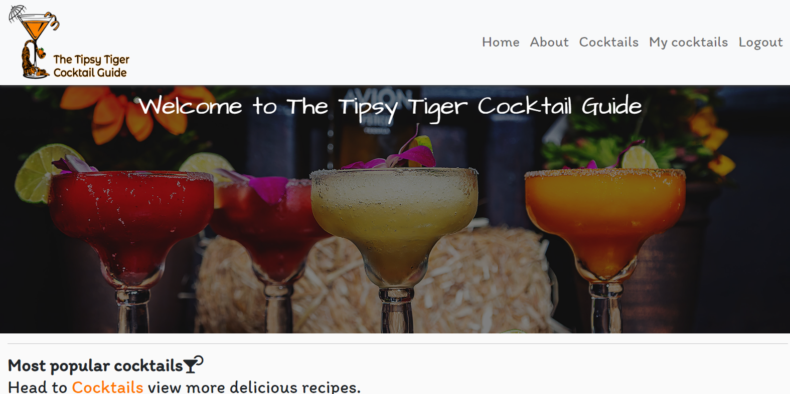
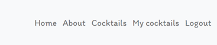
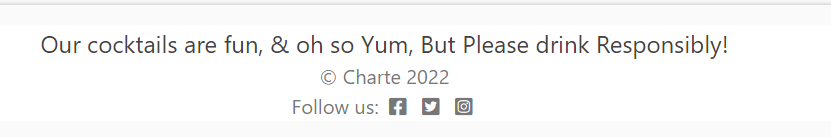
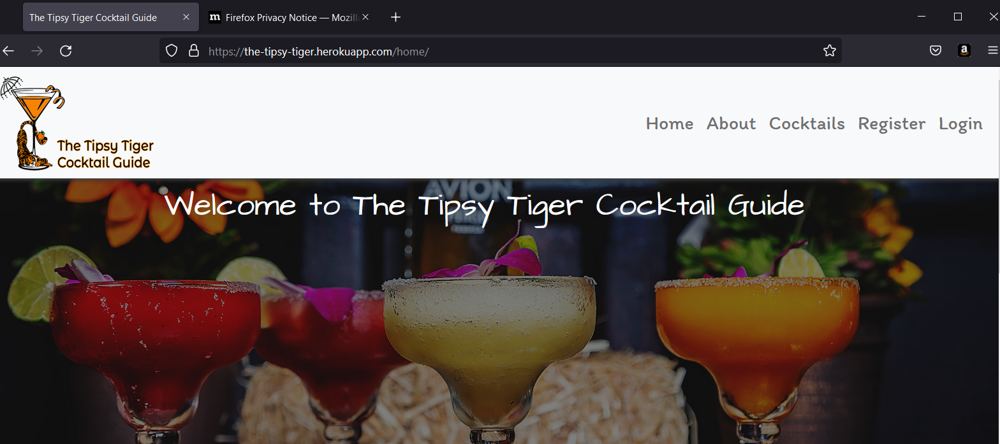

# Table of contents:

- ##  [Automated testing](#Automated-testing)
     - [Settings for testing](#Settings-for-testing)
     - [Unittest](#Unittest)

- ##  [Manual testing](#Manual-testing)
     - [Testing User Stories](#Testing-user-stories)

- ##  [Testing features](#Testing-features)
     - [Navigation](#Navigation)
     - [Logo](#Logo)
     - [Footer](#Footer)
     - [cocktail links](#Cocktail-links)
     - [Snap Shot](#Snap-shot)
     - [About page](#About-page)
     - [Navigation](#Navigation)
     - [Cocktails page](#Cocktails-page)
     - [Filter](#Filter)
     - [Comment Form](#Comment-form)
     - [Register page](#Register-page)
     - [Sign-in](#Sign-in)
     - [Sign-out](#Sign-out)
     - [Cocktail recipe form](#Cocktail-recipe-form)
     - [404 error](#404-error)
     - [500 error](#500-error)

- ##  [Browser Compatability](#Browser-Compatability)
     - [Browsers](#Browsers)  
     - [Responsiveness](#Responsiveness)  

- ##  [Bugs](#Bugs) 
     - [Resolved](#Resolved)
     - [Unresolved](#Unresolved)

- ##  [Code Validation](#Code-validation) 
     - [HTML](#HTML)
     - [HTML validation issues](#HTML-validation-issues)
     - [CSS validator](#CSS-validator)
     - [PEP 8 Validation](#PEP-8-Validation)
     - [Lighthouse](#Lighthouse)

## Automated Testing
### Settings for testing in local environment
Having followed the instructions recomended in the course material, there was errors in connecting to Posgres database for testing. In order to use the Sqlite database instead, the following code was added.

In settings.py:


In env.py (to toggle between the databases False for Postgres, True for Sqlite):
```
os.environ["DEVELOPMENT"] = "True"
```
Then run the migrations to update the database
```
python3 manage.py makemigrations
python3 manage.py migrate
```

### Unittest
Unittest was used for automated testing of the project. URLS, Models, and views were tested. A total test coverage of 85% was achieved.


## Manual Testing
The project was thoroughly tested by the developer and multiple user from friends and family members. Following User stories created the steps and results are as follows.

### Testing User Stories
### Epic: Set up an admin page to manage posts, reviews, comments and user.
To test the admin page created to fulfill this epic begin with the following steps:
1. Navigate to the website of [The Tipsy Tiger Cocktail Guide](https://the-tipsy-tiger.herokuapp.com/)
2. Click on the 'Sign In' tab on the navigation bar.
3. Sign in with admin credentials
4. Navigate to [admin page](https://the-tipsy-tiger.herokuapp.com/admin)

### *User Story*
* As an admin I can post content so that there is a decent library of recipes.( Must have / completed)[#1](https://github.com/Charte-dot/The-Tipsy-Tiger-cg/issues/1)

Description: The admin can create and post content to keep site updated.

**Testing steps**
1. In the admin panel on the left side of the page, click add button under the recipe heading.
2. In the recipe form, enter content in each field.
3. Click save to create the cocktail recipe.


**Expected Result**: A cocktail recipe is saved by default to the list of recipes in the admin panel.

**Actual Result**: A cocktail recipe is saved to the admin panel.


**Pass/Fail: Pass**

### *User Story*
* As an admin I can approve content so that the it's only relevant content posted.( must have / completed)
[#2](https://github.com/Charte-dot/The-Tipsy-Tiger-cg/issues/2)

Description: The site admin is able to create, read, update and delete cocktails.

**Testing steps**
* To create a recipe:
1. in the admin panel menu on the left click add button on the recipe catagory.


2. In the recipe form enter contents of chosen cockatail.
3. Change the status to published in the dropdown menu.
4. Click save to created the cocktail recipe.

**Expected result**: The recipe is saved as 'published' to the list of recipes and viewable on the main site.

**Actual Results**: The recipe is saved as 'published' to the list of recipes and viewable on the main site.

**Pass/Fail: Pass**

* To read/update a recipe:

1. In the admin panel list select a recipe title to read the full recipe.
2. To update the recipe update the fields required and click save.

**Expected Result**: The viewed/updated recipe is saved to the list of recipes.
**Actual Result**: The viewed/updated recipe is saved to the list of recipes

**Pass/Fail: Pass**

* To delete a recipe:
1. To delete a recipe in the admin panel, selected the recipe to be deleted in the checkbox beside the title.
2. In the action dropdown menu above the list select 'delete' and 'go' to delete the recipe.

**Expected Result**: The viewed/deleted recipe is deleted from the admin panel and not viewable on the main site.
**Actual Results**:The viewed/deleted recipe is deleted from the admin panel and not viewable on the main site.

**Pass/Fail: Pass**

### *User Story*
As an admin I can approve comments so that I can filter inappropriate content.( must have/ completed)[#3](https://github.com/Charte-dot/The-Tipsy-Tiger-cg/issues/3)


**Testing steps**:
1. In the admin panel select comments to view a list of draft and published comments.
2. In the list select a review in the checkbox.
3. In the action dropdown menu above the list select 'approve selected comment' or 'delete selected comment' then 'go'.

**Expected Results**:
1. The approved comment is published on the website.
2. The unapproved comment is removed from the list of comments.

**Actual Results**: 
1. The approved comment is published on the website.
2. The unapproved comment is removed from the list of comments.

**Pass/Fail: Pass**

### Epic: Enable users to set up an accounton the website to access the full features.
#### *User Story*:
* As a user I can register an account so that I can access the full range of features on the site (must-have / completed)
[#4](https://github.com/Charte-dot/The-Tipsy-Tiger-cg/issues/4)

**Testing Steps**:
1.  Navigate to the website of [The Tipsy Tiger Cocktail Guide](https://the-tipsy-tiger.herokuapp.com/)
2. Click on the 'register' tab on the navigation menu.
3. Create an account with username, email(optional) and password.

**Expected Results**:
1. Message displays 'You have successfully signed in'.
2. Sign in link in the navigation changes to Sign Out.
3. My cocktails tab is now displayed in the navigation bar.

**Actual Results**: 
1. Message displays 'You have successfully signed in'.
2. Sign in link in the navigation changes to Sign Out.
3. My cocktails tab is now displayed in the navigation bar.

**Pass/Fail: Pass**


*Registration form*


*Sign in message*

#### *User Story:
*As a user I can login and logout to the site so that I can access my content and interact with other users content.(Must Have / completed)[#5](https://github.com/Charte-dot/The-Tipsy-Tiger-cg/issues/5)

**Testing Steps**:
1. Navigate to the website of [The Tipsy Tiger Cocktail Guide](https://the-tipsy-tiger.herokuapp.com/)
2. Click on the 'Sign in' link in the navigation bar and sign in with username and password.
3. Click on the 'Sign out' link on the naviagtion bar.

**Expected Results**:
1. Message displays 'You have successfully signed in'.
2. Message displays 'You have signed out'.
3. The sign in link changes to sign in/sign out depending on users action.

**Actual Results**:
1. Message displays 'You have successfully signed in'.
2. Message displays 'You have signed out'.
3. The sign in link changes to sign in/sign out depending on users action.
**Pass/Fail: Pass**


*Sign in message*


*Sign out message*


*Signed in view to user*

### *User Story*:
*As an admin I can set an age verification so that underage users can't access alcohol based topics. ( Must Have / complete)
[#6](https://github.com/Charte-dot/The-Tipsy-Tiger-cg/issues/6)

**Testing Steps**:
1. Navigate to the website of [The Tipsy Tiger Cocktail Guide](https://the-tipsy-tiger.herokuapp.com/)
2. If the user is over 18 click 'I am over 18' button and access is granted to site.
3. If user is under 18 click ' I am not over 18' button and is redirected to a decline page.

**Expected Results**:
1. If user is over 18 age verification redirects to home page on the website.
2. if User is under 18 age verification redirects to decline page.

**Acutal Results**: 
1. If user is over 18 age verification redirects to home page on the website.
2. if User is under 18 age verification redirects to decline page.
**Pass/Fail: Pass**


*Age verification*


*Decline page*

### Epic: Create an attractive landing page to entice new users and get them to register an account.

#### *User Story*:
*As a user I can see a show case of recipes so I know what style of content is published on the site( must-have / complete)[#10](https://github.com/Charte-dot/The-Tipsy-Tiger-cg/issues/10)

**Testing Steps**:
1. Navigate to the website of [The Tipsy Tiger Cocktail Guide](https://the-tipsy-tiger.herokuapp.com/)
2. Scroll down the page to view most popular cocktails on the site.
3. Scroll down to view the most recent cocktails posted.
4. Scroll down to view the 'Join us' and register option.

**Expected Results**:
1. Text visible on the Join us explaining the site.
2. Call to action 'Register' button on bottom of the page.
3. Text indicating that users must register to interact and post cocktails.
4. Three of the most recent cocktails displaying on page.
5. Nav tab 'cocktails' displays all posted cocktails visable to all users.

**Actual Results**:
1. Text visible on the Join us explaining the site.
2. Call to action 'Register' button on bottom of the page.
3. Text indicating that users must register to interact and post cocktails.
4. Three of the most recent cocktails displaying on page.
5. Nav tab 'cocktails' displays all posted cocktails visable to all users.
**Pass/Fail: Pass**




### Epic: Enable registered users to CRUD their own reciepes

### *User Story*: 
*As a registered user I can create, read, update and deleted my own recipes so that I can manage my own content. ( Must Have / completed).[#9](https://github.com/Charte-dot/The-Tipsy-Tiger-cg/issues/9)

**Testing Steps**:
1. Navigate to the website of [The Tipsy Tiger Cocktail Guide](https://the-tipsy-tiger.herokuapp.com/)
2. Click the 'sign in' link on the navigation bar and sign in with username and password.
3. Navigate to [The Tipsy Tiger](https://the-tipsy-tiger.herokuapp.com/myrecipes/) to view the list of cocktails from the logged in user.
4. Click on View to see the full cocktail recipe details page.
5. Click on edit in the cocktails list to view the original recipe form, edit the field the require updating and click submit to save changes.
6. Click on delete beside the recipe in the list to delete the cocktail recipe.

**Expected Results**
1. Full recipe detail page opens when view option is clicked.
2. The cocktail recipe is updated on the site when edits are submitted.
3. Success messages displays when updates cocktail recipe is submitted.
4. Confirmation message displays when the user clicks delete.
5. Success message displays when user successfully deletes a cocktail.

**Actual Results**
1. Full recipe detail page opens when view option is clicked.
2. The cocktail recipe is updated on the site when edits are submitted.
3. Success messages displays when updates cocktail recipe is submitted.
4. Confirmation message displays when the user clicks delete.
5. Success message displays when user successfully deletes a cocktail.
**Pass/Fail: Pass**


*My cocktails View*


*Within the recipe details page for users cocktail*

### Epic: Show case the most populate recipes on the main landing page 
### *User story*:
*As a user I can view a list of recipes so that I can see what content is available before I decide to register. ( Must Have / completed)[#12](https://github.com/Charte-dot/The-Tipsy-Tiger-cg/issues/12)

**Testing Steps**:
1. Navigate to the website of [The Tipsy Tiger Cocktail Guide](https://the-tipsy-tiger.herokuapp.com/)
2. Click on the 'cocktails' link on the navigation bar to view the recipes posted on the site.
3. Scroll down to view a summary of all recipes currently posted.

**Expected Result**: User is redirected to the recipes page.

**Actual Results**: User is redirected to the recipes page.

**Pass/Fail: Pass**


### Epic: Enable users to Filter content to find recipes with certain ingrediants.
#### *User Story*
As a User I can filter recipes by ingrediants so that i can find content easily.(Should have / complete)[#13](https://github.com/Charte-dot/The-Tipsy-Tiger-cg/issues/13)

**Testing Steps**:
1. Navigate to the website of [The Tipsy Tiger Cocktail Guide](https://the-tipsy-tiger.herokuapp.com/)
2. Log in to site.
3. Click on the 'mycocktails' link in the navigation bar.
4. Click on the dropdown tab labeled skill to filter skill level.
5. Click on the dropdown tab labeled base to filter base alcohol in the cocktail
6. To show all cocktails leave each filter field blank.

**Expected Result**:
List of cocktails corresponding to the filter input by user is displayed or 'Sorry this type of cocktail hasn't been added yet!' if there is no match.

**Actual Result**:
List of cocktails corresponding to the filter input by user is displayed or 'Sorry this type of cocktail hasn't been added yet!' if there is no match.

**Pass/Fail: Pass**


*Skill filter*


*Base filter*

### Epic: Enable registered users to be able to interact with posts from other users.

#### *User Story*:
*As a registered user I can click on a post to view a full page recipe(Must Have)[#15](https://github.com/Charte-dot/The-Tipsy-Tiger-cg/issues/15)

**Testing Steps**:
1. Navigate to the website of [The Tipsy Tiger Cocktail Guide](https://the-tipsy-tiger.herokuapp.com/)
2. Login using username and password.
3. Navigate to 'cocktails' page on the navigation bar.
4. Click on cocktail recipe of choice

**Expected Result**:
User is redirected to the full cocktail recipe details page. User not logged in is redirected to the sign-in page.

**Actual Results**:
User is redirected to the full cocktail recipe details page. User not logged in is redirected to the sign-in page.

**Pass/Fail: Pass**

#### *User Story*:
*As a registered user I can Like or Unlike other users posts so I can interact with the site.( Must Have / complete)[#15](https://github.com/Charte-dot/The-Tipsy-Tiger-cg/issues/15)

**Testing Steps**:
1. Navigate to the website of [The Tipsy Tiger Cocktail Guide](https://the-tipsy-tiger.herokuapp.com/)
2. Login into site
3. Click on 'cocktails' link in navigation page
4. Click on cocktail of choice.
5. Click in the glass icon to toggle a cheers/like on the cocktail recipe.

**Expected Result**:
1. When user clicks on the glass a number updates beside the icon
2. Message alerts that a cheers was left on cocktail
3. Message alerts when cheer is removed from cocktail

**Actual Result**:
1. When user clicks on the glass a number updates beside the icon
2. Message alerts that a cheers was left on cocktail
3. Message alerts when cheer is removed from cocktail

**Pass/Fail: Pass**


#### *User Story*
* As a registered user I can comment on other recipes to help with overall UX( Must Have / completed)[#16](https://github.com/Charte-dot/The-Tipsy-Tiger-cg/issues/16)

**Testing Steps**:
1. Navigate to the website of [The Tipsy Tiger Cocktail Guide](https://the-tipsy-tiger.herokuapp.com/)
2. Login in to site
3. Click on the 'cocktail' link on the navigation bar.
4. Click on coktail recipe of choice and navigate to the bottom of the recipe details page.
5. Enter comment in comment box and click 'submit'

**Expected Result**: 
1. A message thanking the user for their thought displays at the top of the page.
2. Comment box disappear and a message 'Your comment is awaiting approval'. Comment appears in admin panel.

**Actual Results**:
1. A message thanking the user for their thought displays at the top of the page.
2. Comment box disappear and a message 'Your comment is pending admin approval'. Comment appears in admin panel.

**Pass/Fail: Pass**


## Testing Features

### Navigation
* Check that all navigation links work as expected.

**Testing Steps**
1.  Navigate to the website of [The Tipsy Tiger Cocktail Guide](https://the-tipsy-tiger.herokuapp.com/)
2. Without logging in click the multiple links on the nav bar.
3. Log into account and click on the links to ensure the logged in user links work as expected.
4. Scroll down each page to view 

**Expected Results**
1. User not logged in can view home, about, cocktails, register, and sign-in.
2. Each of these links open on the expected page.
3. Registered users can view home, about, cocktails, mycocktails and logout.
4. Each of these links bring the user to the ecxpeted pages.
5. Hover is active on each nav link tab.

**Actual Results**
1. User not logged in can view home, about, cocktails, register, and sign-in.
2. Each of these links open on the expected page.
3. Registered users can view home, about, cocktails, mycocktails and logout.
4. Each of these links bring the user to the ecxpeted pages.
5. Hover is active on each nav link tab.

**Pass/Fail: Pass**


*Nav bar view for unregistered/ non logged in users*


*Nav bar view for registered/ logged in users*

### Logo
* Check that the site logo links back to home page.

**Testing Steps**
1. Open each page from the nav bar and click the logo to return to the home page.

**Expected Results**
* Logo links back to the home page

**Actual Results**
* Logo links back to the home page.

**Pass/Fail: Pass**


### Footer
* Check that the social media links to social media sites directs the user to the correct socila media site.

**Testing Steps**
* Click on each social media icon

**Expect Results**
* Each icon opens each corresponding social media site.

**Actual Results**
* Each icon opens each corresponding social media site.

**Pass/Fail: Pass**



### Cocktails/Mycocktails links
*Check that links in Latest cocktails text direct users to correct page. Cocktails page link goes to cocktails page and My cocktails link takes not logged in users to Sign In page and logged in users to My cocktails page.

**Testing Steps**
1. Click on links without logging in
2. Click on links after logging in

**Expected Results**
1. Both users are directed to cocktails Page
2. Only logged in user can open My cocktails page while not logged in user is directed to Sign In page

**Actual Results**
1. Both users are directed to cocktails Page
2. Only logged in user can open My cocktails page while not logged in user is directed to Sign In page

**Pass/Fail: Pass**


### Snapshot view on main page
* Check that the images are of the most recent cocktails and the title, date added and author are visible.

**Testing Steps**
1. Log in to admin panel
2. Check list of recipes
3. Check that the three images correspond to the most recent recipe additions

**Expected Result**:
* The three recipes are the most recent additions and the most recent is first. Title, date added and author clearly labled.

**Actual Result**:
* The three recipes are the most recent additions and the most recent is first. Title, date added and author clearly labled.

**Pass/Fail: Pass**


### About page
* Check that the links in the about page redirect the user to register, cocktails page and login page.

**Testing Steps**
1. Logout of site if signed in.
2. Click on register button to view register page
3. Click on cocktails link to view coktails page
4. click on the sign-in button to view sign in page.

**Expected Results**
1. Register button redirects to register form
2. Cocktails link redirects to cocktails page.
3. Sign-in button links to sign-in page.
4. If User is already sign in and clicks register or sign-in button, page automatically redirects to cocktails page.

**Actual Results**
1. Register button redirects to register form
2. Cocktails link redirects to cocktails page.
3. Sign-in button links to sign-in page.
4. If User is already sign in and clicks register or sign-in button, page automatically redirects to cocktails page.

**Pass/Fail: Pass**


### Cocktails page
### Image link
* Check that all images with summary description are visable on the page and that the title link redirects logged in user to the full cocktail recipe details. Users not logged in are redirected to the sign-in page.

**Testing Steps**
1. Be sure to be signed out and click on the title of the cocktail of your choice.
2. Sign in and click on the title of the cocktail of your choice.

**Expected Results**
1. Not logged in user is redirected to Sign In page
2. Logged in user is redirected to full cocktail recipe detail page

**Actual Results**
1. Not logged in user is redirected to Sign In page
2. Logged in user is redirected to full cocktail recipe detail page

**Pass/Fail: Pass**


### Filter box
* Check that the filter will locate a cocktail with the filter parameters set by user.

**Testing Steps**
1. Dropdown the skill filter and choose which skill level you want.
2. Dropdown the base filter and choose which base alcohol for the cocktails you want.
3. Click the search icon.

**Expected Results**
1. The search icon starts the search function
2. The search result displays one or more cocktails with the filter parameters set.
3. 'No cocktails to view' is displayed if none are found.

**Actual Results**
1. The search icon starts the search function
2. The search result displays one or more cocktails with the filter parameters set.
3. 'No cocktails to view' is displayed if none are found.

**Pass/Fail: Pass**


### Comment Form
* Checks that the form submits when a user leaves a comment.
* Checks that success message appears after comment is left.
* Checks that a 'Your comment is pending approval is shown until an admin approves the comment for public viewing

**Testing Steps**
1. Enter text into the body of the comment
2. Click submit
3. Log into the admin panel
4. Check the box beside the comment just added and select approve in th dropdown menu
5. Navigate back to the same recipe

**Expected Results**
1. Comment is submitted and can be viewed in the admin panel
2. Message of success appears on submission and disappears automatically
3. When review is approved it appears in the comments section of the recipe

**Actual Results**
1. Comment is submitted and can be viewed in the admin panel
2. Message of success appears on submission and disappears automatically
3. When review is approved it appears in the comments section of the recipe.

**Pass/Fail: Pass**


*Comment and comment form*


*Comment success message*


*Admin approval message*

#### Register Page
* Check that users can register for an account by entering a username, an optional email and a password
* Check that the button Sign Up registers the user
* Check that the Home button redirects to the home page

**Testing Steps**
1. Click Register
2. Click the Home button
3. Click on the Register button again
4. Enter a username and password without email
5. Click Sign Up
6. Navigate to admin panel to see user listed

**Expected Results**
1. Home button redirects to Home page
2. User receives error message if password does not conform to requrements of length, difference to username
3. User registers successfully and success message displays
4. User is listed as User in admin panel

**Pass/Fail: Pass**


#### Sign-In Form
* Check that User signs in by entering username and password
* Check that Sign In button submits the form
* Check that Home button redirects to the home page

**Testing Steps**
1. Enter a username without password
2. Enter a username with password
3. Click Home
4. Repeat steps 1 and 2 and click sign in

**Expected Results**
1. Error message displays if user does not enter a username and password
2. User signs in successfully with username and password
3. Success message is displayed and disappears automatically
4. User is redirected to Home page if Home is clicked

**Actual Results**
1. Error message displays if user does not enter a username and password
2. User signs in successfully with username and password
3. Success message is displayed and disappears automatically
4. User is redirected to Home page if Home is clicked

**Pass/Fail: Pass**


#### Sign-Out Page
* Check that Sign Out button signs user out. 
* Check that Home button redirects user to Home page
* Check that user is redirected to home page after signing out:

**Testing Steps**
1. Click Sign Out in the navigation menu
2. Click Home button
3. Repeat step 1
2. Click Sign Out in the Sign Out page

**Expected Results**
1. Home button redirects user to Home page
2. Sign out button signs user out and message displays to tell user they have signed out
3. User is redirected to Home page after signing out

**Actual Results**
1. Home button redirects user to Home page
2. Sign out button signs user out and message displays to tell user they have signed out
3. User is redirected to Home page after signing out

**Pass/Fail: Pass**


*Sign out*


*Sign out message*

### Cocktail recipe form
* Check that the user can submit a cocktail to the database for display on the website and is then redirected to the cocktails page.

**Testing Steps**
**Testing Steps**
1. Click Add a Recipe in the My Cocktails page
2. Click Go Back button
3. Repeat step 1
4. Click Submit with blank fields
5. Complete all required fields (not image) and click Submit
6. Click Add a cocktail and complete all fields and upload an image.
7. Click Submit
8. Navigate to the Home, cocktails and My cocktails pages to check the recipes are displaying, one with placeholder image and one with user's own

**Expected Results**
* Go Back button at the top redirects users to the My cocktails page
* Messages appear to indicate if required fields have not been filled in before submission.
* User can enter text in fields
* Dropdown menus function correctly
* User cannot enter incorrect values or out of range values in fields
* User can upload an image in the image field.
* If no image is uploaded a placeholder image is used.
* When submit button is clicked the recipe is uploaded to the database and appears on the Home page, cocktails page and My cocktails page
* The user is redirected to My cocktails page after submitting a recipe

**Actual Results**
* Go Back button at the top redirects users to the My cocktails page
* Messages appear to indicate if required fields have not been filled in before submission.
* User can enter text in fields
* Dropdown menus function correctly
* User cannot enter incorrect values or out of range values in fields
* User can upload an image in the image field.
* If no image is uploaded a placeholder image is used.
* When submit button is clicked the recipe is uploaded to the database and appears on the Home page, cocktails page and My cocktails page
* The user is redirected to My cocktails page after submitting a recipe

**Pass/Fail: Pass**


*Cocktail form*


*Success alert*

#### 404 Page
* Check that the 404 page displays when the user enters a url which does not exist. 

**Testing Steps**
1.  Navigate to the website of [The Tipsy Tiger Cocktail Guide](https://the-tipsy-tiger.herokuapp.com/)
2. Type in an incorrect url

**Expected Result**
1. 404 page displays

**Actual Result**
1. 404 page displays

**Pass/Fail: Pass**


#### 500 Page
* Check that a 500 server error page displays to handle internal server errors

**Testing Steps**
1. Create incorrect file path for image
2. Navigate to the website of [The Tipsy Tiger Cocktail Guide](https://the-tipsy-tiger.herokuapp.com/)

**Expected Result**
1. 500 page displays

**Actual Result**
1. 500 page displays

**Pass/Fail: Pass**


## Browser compatibility
  ## Browsers
* The project was developed on Google Chrome and no issues were detected.
* Aditional tests were conducted on Mozilla Firefox and Microsoft edge with no issues.


*Google Chrome*


*Mozilla Firefox*


*Microsoft Edge*

## Responsiveness
The website was developed on a 15" laptop and a 24" monitor and no issues were found.

Chrome Developer tools were used to check responsiveness on all sized devices throughout the process and adjustments were made.

Additional tests were conducted in the later stages on various mobile devices: 
* Moto G8+
* IPhone 11
* Iphone SE2 
* IPhone XR. 


## Bugs 
### Resolved 
1. On the smaller screen, the drop down menu was appearing behind the hero image. I troubleshooted this with help of [developer.mozilla docs](https://developer.mozilla.org/en-US/docs/Web/CSS/z-index) and found a solution of adding 'z-index 100' to css on nav bar nav for dropdown menu on smaller screens.
2. The logo when added to the nav bar brand, wasn't responding to css re-sizing. By using bootstrap I managed to re-size the logo to fit in the nav bar by entering the width and height into img scr tag.
3. While testing, I had a number of a tags with in a button. W3C called this as an error. Upon changing out a tags with buttons class with in the tag. This resolved the issue of button errors on html checker.

### Unresolved
The nav bar is styled to highlight when a user hovers over the nav link. I had the nav bar set to stay highlighted on the link once a user chooses that page.
The nav active was only highlighting the 'about page' and 'mycocktails page' and other pages of home, coctails, register, sign-in, sign-out wouldn't stay highlighted once the link was clicked.

This bug is still unresolved as after thorough testing and code review, I cannot find what is blocking and interacting with certain links and preventing them from staying highlighted once active.


## Code Validation
### HTML Validation
Html was validated by [The WEC Markup Validation Service](https://validator.w3.org/)

No errors or warnings were found:

* Age verication page: 


* Decline Page:


* Home Page: 


* About Page:


* Cocktails Page


* My Cocktails Page


* Register Page


* Sign In Page


* Sign Out Page


## HTML validation issues
**Cocktail Filter**
* When passing through the html for cocktails page, W3C validator threw up errors from the filter in which the template is provided by django filter form. In order to validate the html I had to code out the filter and pass through the code again. 


*Error on HTML validator*


*Failed code*


*Coded out filter to pass html validator*


*cocktails Page passed with coded out filter*

### CSS validator


### PEP 8 Validation

The following files were checked:

* **Tipsy Tiger views.py**


* **recipes/views.py**


* **models.py**


* **forms.py**


* **urls.py**


* **admin.py**


* **test_models.py**


* **test_views.py**


* **test_urls.py**


* **settings.py**

The test returned the following line too long errors


### Lighthouse

All pages were checked on lighthouse with the results between 80% and 100% for each page on mobile and desktop. Desktop results: 

* **Home Page**


* **About Page**


* **Recipes Page**


* **My Recipes Page**


* **Recipe Detail Page**

